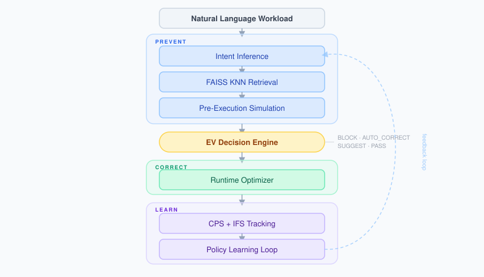

# PBCP — Pre-Billing Cost Prevention Framework

> Intent-aware cloud governance system that prevents compute waste before billing using hybrid NLP, FAISS KNN retrieval, and decision-theoretic intervention.

<div align="center">


[](https://intent-aware-cloud-governance.streamlit.app/)
[](IACG_Design_Document.md)
[](docs/EXPERIMENTS.md)

</div>

> **Research Prototype** — PBCP is a controlled cloud systems research prototype and evaluation benchmark. It is not a production governance platform. Production deployment would require calibration against an organization's own telemetry and enforcement stack.

---

## Live Demo

<p align="center"></p>

[](https://intent-aware-cloud-governance.streamlit.app/)

The Streamlit demo includes:

| Section | What it shows |
|---|---|
| Overview | Architecture, KPIs, comparison with existing approaches |
| Prevention Engine | Intent inference, pre-execution simulation, AUTO_CORRECT / SUGGEST / PASS decisions |
| Runtime & Savings | CPS, IFS, intervention timeline, workload type breakdown |
| Learning System | Phase 3 convergence, policy synthesis, feedback loop |

### First time here? Here's your five-minute tour 🗺️

> Not sure where to click? Start here — you'll be an expert in five minutes.

1. **[Overview](https://intent-aware-cloud-governance.streamlit.app/overview)** — Land here first. Two minutes of reading tells you what the whole system does and why it matters. Scan the KPI row at the top; those numbers are your anchor.

2. **[Prevention Engine → Live Demo tab](https://intent-aware-cloud-governance.streamlit.app/prevention_engine)** — The fun part. Pick one of the three preset scenarios (or type your own job description) and hit **Run**. Watch PBCP decide whether to block it, fix it, suggest a change, or let it through — *before* billing. This is the "aha" moment.

3. **[Prevention Engine → Anomaly Detection tab](https://intent-aware-cloud-governance.streamlit.app/prevention_engine)** — Still on the same page, just switch tabs. See how the IFS-based detector outperforms a plain CPU-threshold check for catching jobs that lied about what they'd do.

4. **[Runtime & Savings](https://intent-aware-cloud-governance.streamlit.app/runtime_savings)** — The receipt. How much did the system actually save? Scroll through the CPS bars by stage and workload type. The IFS histogram shows how well jobs kept their promises.

5. **[Learning System → Feedback Loop tab](https://intent-aware-cloud-governance.streamlit.app/learning_system)** — The punchline. PBCP doesn't just catch mistakes — after seeing the same failure three times, it writes its own prevention rule. The Convergence chart shows CPS climbing 8× higher *with* this learning loop versus without it.

---

## What PBCP Does

- Infers workload intent from natural-language descriptions.
- Predicts waste before provisioning through retrieval and pre-execution simulation.
- Applies `BLOCK` / `AUTO_CORRECT` / `SUGGEST` / `PASS` decisions before or during execution.
- Tracks impact using CPS, ESR, and IFS.

## Why This Matters

Traditional cloud governance systems detect waste after infrastructure has already been provisioned, used, and billed. PBCP shifts the decision point earlier: it infers workload intent, predicts likely waste, and applies governance intervention before cost is incurred.

Example: a team submits a 20-node cluster for a short ETL workload. The job finishes, but the cluster remains idle. A traditional FinOps alert arrives after the waste already exists; PBCP can block, suggest, or auto-correct the request before billing begins.

## Architecture

PBCP is organized around a simple loop: **Prevent → Correct → Learn**.

```text
Natural Language Workload
→ Intent Inference
→ FAISS KNN Retrieval
→ Pre-Execution Simulation
→ EV Decision Engine
→ Runtime Optimizer
→ CPS + IFS Tracking
→ Policy Learning Loop
```

- **Prevent**: infer workload intent, retrieve similar historical cases, simulate likely waste, and choose an intervention.
- **Correct**: apply runtime actions when observed behavior diverges from declared intent.
- **Learn**: update policies and improve prevention quality over repeated generations.

> **Metric note:** IFS is defined as cosine similarity between intent and behavior embeddings. Dashboard sub-scores are interpretability aids only — not the canonical research metric.



## Key Results

| Experiment | Metric | Value |
|---|---|---|
| Exp 0 — Calibration | Utilization MAE | 0.054 |
| Exp 0 — Calibration | Cost rel-RMSE | 0.306 † |
| Exp 1 — Pre-Provision | Showcase CPS (20→10 nodes) | 0.500 |
| Exp 2 — Runtime | Scenario C prevented cost | $97.92 |
| Exp 3 — IBD Detection | IFS Detector F1 | 0.761 |
| Exp 3 — IBD Detection | CPU-threshold baseline F1 | 0.605 |
| Exp 5 — System Roll-up | Valid CPS | 0.559 |
| Exp 5 — System Roll-up | ESR | 0.981 |
| Exp 6 — Convergence | Peak Full PBCP CPS | 0.733 |
| Exp 6 — Convergence | Peak No-Phase-3 CPS | 0.090 |
| Exp 6 — Convergence | Improvement vs. no-Phase-3 | **8.1×** |

> † Cost rel-RMSE reflects submission-time duration uncertainty (±25% by design).
> Pre-execution cost prediction inherently carries this uncertainty; 0.306 is within
> the expected range for submission-time models.

---

## Quick Start

```bash
git clone https://github.com/Keerthi-Rapolu/intent-aware-cloud-governance.git
cd intent-aware-cloud-governance
pip install -r requirements.txt

# Generate dataset
python data/generate_dataset.py

# Run benchmark
python -m evaluation.benchmark

# Launch Streamlit
streamlit run app/app.py
```

> The hosted demo uses keyword-based intent inference in place of DistilBERT; FAISS KNN retrieval
> and the full NLP pipeline are only available when running locally.

---

## Repository Structure

```
IACG/
├── intent_model/           # Intent inference: DistilBERT + FAISS KNN
├── simulation_engine/      # Pre-execution cost simulation + EV model
├── policy_engine/          # Policy registry + learner + enforcer
├── runtime_optimizer/      # Runtime anomaly detection + correction
├── cps_metrics/            # CPS + IFS tracking
├── experiments/            # Exp 0, 1, 2, 3, 5, 6 scripts
├── app/                    # Streamlit 4-page research demo
│   ├── app.py                  Entry point
│   ├── components/
│   │   ├── data_loader.py      Cached DuckDB queries (@st.cache_data)
│   │   └── charts.py           Plotly chart builders
│   └── pages/
│       ├── overview.py         Architecture, KPIs, comparison table
│       ├── prevention_engine.py  Live Demo + Workload Catalogue + Anomaly Detection
│       ├── runtime_savings.py  CPS/IFS dashboard + Intervention timeline
│       └── learning_system.py  Convergence study + Feedback loop
├── data/                   # Synthetic 500-workload benchmark generator
└── config/                 # Cloud pricing, simulation, policy, CPS parameters
```

## Further Reading

- [Design Document](IACG_Design_Document.md)
- [Technical Details](docs/TECHNICAL_DETAILS.md)
- [Experiments](docs/EXPERIMENTS.md)
- [Dashboard Guide](docs/DASHBOARD_GUIDE.md)

## Authors

- **Keerthi Rapolu** — First Author; system architecture, intent inference, pre-execution simulation, EV intervention model, runtime optimizer, CPS/ESR evaluation, Streamlit research demo.
  Modules: `intent_model/` · `simulation_engine/` · `policy_engine/` · `runtime_optimizer/` · `cps_metrics/` · `app/`

- **Sreeja Katta** — Second Author; Intent-Fit Score (IFS) subsystem and formula design, IBD detection experiment (Exp 3) comparing IFS-based vs CPU-threshold anomaly detectors, anomaly root cause analyzer, prevention feedback loop (`AnomalyPreventionFeedback`) that auto-generates learned policies from recurring failure patterns, Streamlit dashboard pages for anomaly detection and the learning system.
  Modules: `ifs/` · `anomaly_rca/` · `experiments/exp3_ibd_detection.py` · `visualization/exp3_ibd_chart.py` · `tables/table3_ibd.py`

## Citation

```bibtex
@misc{rapolu2026pbcp,
  title  = {PBCP: A Pre-Billing Cost Prevention Framework for Intent-Aware Cloud Governance},
  author = {Rapolu, Keerthi and Katta, Sreeja},
  year   = {2026},
  note   = {IACG v2.0 Research Prototype. Manuscript under review.}
}
```
